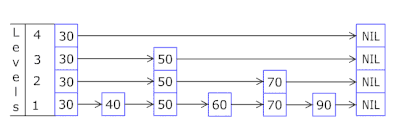
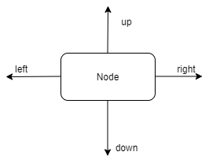

# 跳表

## 什么是跳表

https://en.wikipedia.org/wiki/Skip_list

红黑树实现比较复杂，跳表实现相对简单。首先，元素必须是**排好序的**，相对于链表，跳表的元素多了两个指针。跳表的实现**以链表为基础**，**比平衡二叉树简单得多**

跳表和红黑树一样可以实现高效的插入、删除、查找操作

1、要查询一个数字，怎么查？

最简答的就是一个个对比，时间复杂度O(N)，

二分查找？ O(logN)

2、要插入一个数字

3、删除

4、更新

跳表的特点：

1、一种随机的数据结构

2、最底层包含整个调表的所有元素

3、**典型的空间换时间算法**

## 跳表的应用

1、Redis 中的 OrderSet（有序集合）

跳表在 Redis 中的唯一作用是实现**有序集合**

2、LevelDB

https://github.com/google/leveldb/blob/master/db/skiplist.h

## TODO:

reference:

1、https://github.com/kkdai/skiplist

2、LeetCode 1206. Design Skiplist(hard)

https://leetcode-cn.com/problems/design-skiplist/

用Java代码实现的时候有点像 Trie 数据结构

3、https://mingshan.fun/2019/06/02/skiplist/

4、https://www.youtube.com/watch?v=ypod5jeYzAU

5、数据量一大，测试脚本就挂了？这个不知道啥原因